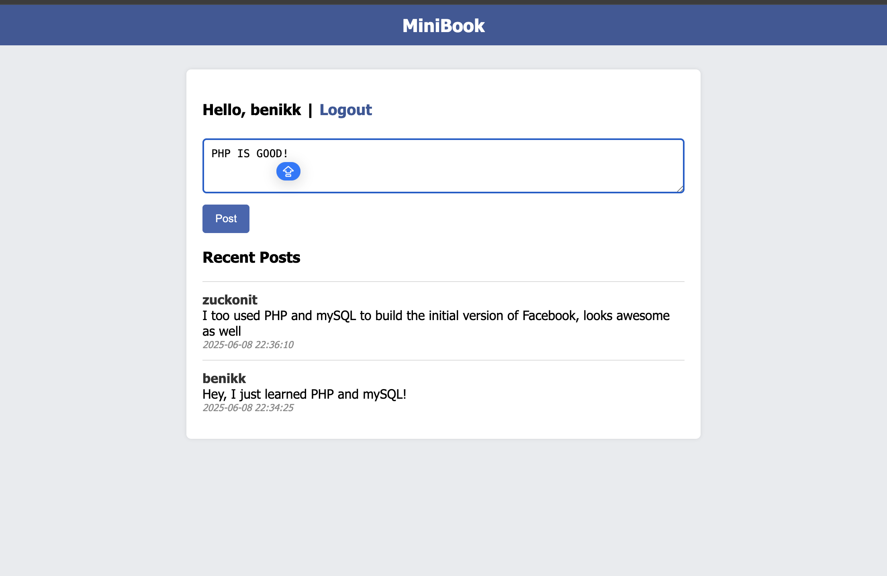

# MINI GROUP

So I was prepping for my **Web Tech exam** and wanted to code a project in PHP.
So yeah , I built this, wanted to know how zuckerberg might have built the initial version of Facebook.

Just a simple app where you can:
-  Register
-  Login
-  Post your random thoughts
-  See what others posted

---

###  Feed

<b>
To run the project, make sure you have Apache and MySQL running in XAMPP.
</b>

By the first looks of it, PHP seems very easy to code.  
Sometimes, changing your stack gives you a good refresher (ofc when the things are easy).

